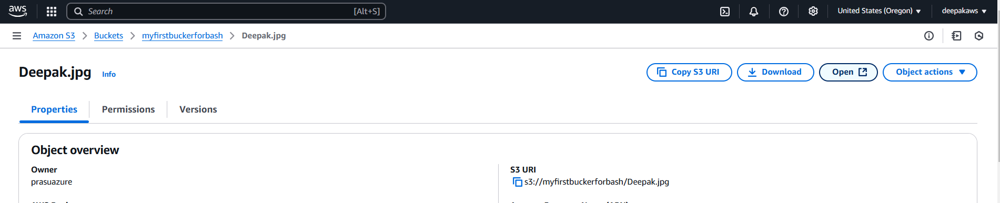
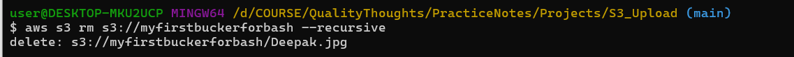

# Uploading Files to S3 via Bash Scripting

## Prerequisites

1. **AWS CLI Installed**
   - If not installed, follow the [AWS CLI Installation Guide](https://docs.aws.amazon.com/cli/latest/userguide/install-cliv2.html)
   
2. **AWS IAM User with S3 Access**
   - Ensure your IAM user has the necessary permissions to upload files to the S3 bucket.

3. **Configured AWS CLI**
   ```sh
   aws configure
   ```
   Provide your AWS Access Key, Secret Key, Region, and Output format when prompted.

## Steps to Upload Files to S3

### 1. Create an S3 Bucket
```sh
aws s3 mb s3://myfirstbuckerforbash
```


### 2. Verify the Bucket Exists
```sh
aws s3 ls
```

### 3. Create a Bash Script to Upload Files
Create a script `upload_to_s3.sh` with the following content:

```sh
#!/bin/bash

# Variables
BUCKET_NAME="myfirstbuckerforbash"
FILE_PATH="/d/COURSE/QualityThoughts/PracticeNotes/Projects/S3_Upload/Deepak.jpg"
S3_KEY="s3://${BUCKET_NAME}/$(basename $FILE_PATH)"

# Check if file exists
if [ ! -f "$FILE_PATH" ]; then
    echo "File does not exist: $FILE_PATH"
    exit 1
fi

# Upload the file
aws s3 cp "$FILE_PATH" "$S3_KEY"

# Verify the upload
if [ $? -eq 0 ]; then
    echo "File successfully uploaded to $S3_KEY"
else
    echo "File upload failed"
    exit 1
fi


```

### 4. Make the Script Executable
```sh
chmod +x upload_to_s3.sh
```

### 5. Run the Script
```sh
./upload_to_s3.sh 
```


### 6. Verify File Upload
```sh
aws s3 ls s3://myfirstbuckerforbash/
```


### 7. Verify the uploaded image from web




### 8. Automate with a Cron Job (Optional)
To automate uploads, add a cron job:
```sh
crontab -e
```
Add the following line to upload a file every hour:
```sh
0 * * * * /path/to/upload_to_s3.sh /path/to/your/file
```
### 9. Remove the bucket after use
```sh
aws s3 rb myfirstbuckerforbash

```
- before removing first empty the bucket 



## Conclusion
This guide helps you automate file uploads to an S3 bucket using a Bash script. Ensure you have AWS CLI configured properly and necessary permissions assigned to avoid issues.
